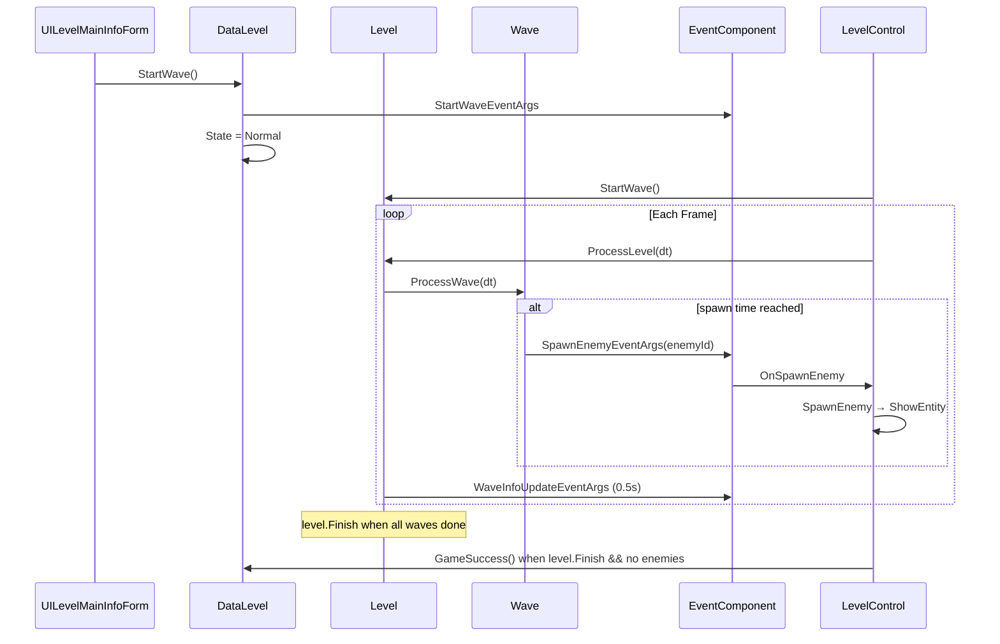

# TowerDefense-GameFramework-Demo — 波次/关卡系统补充说明

> 本文档是对参考项目 [`项目架构文档.md`](../../../TowerDefense-GameFramework-Demo-master/TowerDefense-GameFramework-Demo-master/项目架构文档.md) 的**补充**，聚焦原概述中未展开的运行时流程、数据结构与可借鉴的设计决策。  
> 用途：为 Tower2022 的 Day 5-7（波次、胜负、HUD）提供对照参考。

---

## 1. 原概述已覆盖 vs 本文补充

| 原概述 | 本文补充 |
|--------|----------|
| 目录与类名列表 | 运行时调用链、时序图、关键字段语义 |
| Wave / WaveElement 模块存在 | 累积计时刷怪算法、`FinishWaitTime` 含义 |
| Level 管理波次 | `Level.ProcessLevel` 与 `DataLevel` 状态机协作 |
| SpawnEnemy 事件 | 谁 Fire、谁 Subscribe、与实体层的边界 |
| 胜负判定一句话 | 胜利/失败的精确触发条件 |

---

## 2. 数据模型（配置层）

### 2.1 两级表结构

```
Level (DRLevel)
  └── WaveIds[]          → 引用多个 Wave

Wave (DRWave)
  ├── FinishWaitTime     → 本波「最后一只怪按计划刷出后」额外等待秒数
  └── WaveElements       → int[2] 范围，指向 WaveElement 表连续 ID 段

WaveElement (DRWaveElement)
  ├── EnemyId            → 敌人配置 ID（非实体 ID）
  └── SpawnTime          → 与**上一只**之间的间隔（秒），非绝对时间
```

**示例（Level1 第一波）**：

- `Wave 1001`：`FinishWaitTime=10`，元素范围 `10001~10016`（共 16 条）
- 元素 `10001`：`EnemyId=101, SpawnTime=1`（波内第一只，距波开始 1s）
- 元素 `10002`：`SpawnTime=3`（距上一只 3s）
- ……

第一关共 **10 波**，每波结束等待多为 10s，最后一波为 0s。

### 2.2 运行时包装类

| 配置类 | 运行时类 | 职责 |
|--------|----------|------|
| `WaveData` | `Wave` | 本波计时、出队元素、Fire 刷怪事件 |
| `WaveElementData` | `WaveElement` | 单条刷怪指令 + `CumulativeTime` |
| `LevelData` | `Level` | 波次队列、`CurrentWaveIndex`、关卡结束标记 |

全部实现 `IReference`，由 `ReferencePool` 管理，避免 GC。

---

## 3. 刷怪时序算法（核心）

### 3.1 Wave 创建时预计算累积时间

```text
timer = 0
foreach element in waveElementDatas:
    timer += element.SpawnTime
    queue.Enqueue(WaveElement.Create(element, cumulativeTime=timer))

TotalSpawnTime = timer
NextWaveTime     = timer + FinishWaitTime
```

### 3.2 每帧 ProcessWave

```text
timer += deltaTime

if queue not empty AND timer > queue.Peek().CumulativeTime:
    enemyId = queue.Dequeue().EnemyId
    Fire SpawnEnemyEventArgs(enemyId)

else if queue empty AND timer >= NextWaveTime:
    Finish = true
```

**要点**：

- 刷怪时间点由**累积间隔**决定，支持不规则节奏、混编多种敌人。
- `FinishWaitTime` 在最后一只**按计划刷出之后**才开始计时，与「场上是否还有怪」无关。
- 波次结束（`Wave.Finish`）≠ 场上清空。

### 3.3 Level 驱动多波

```text
Level.ProcessLevel(delta):
    if !startWave or Finish: return

    currentWave = waves.Peek()
    currentWave.ProcessWave(delta)

    if currentWave.Finish:
        waves.Dequeue()
        CurrentWaveIndex++   // 1-based 显示
        Fire WaveInfoUpdateEventArgs

    if waves empty:
        Level.Finish = true  // 所有波的计划刷怪已完成
```

---

## 4. 事件驱动边界（调度 vs 执行）

```text
Wave.ProcessWave
    └── Fire SpawnEnemyEventArgs(enemyId)
            └── ProcedureLevel.OnSpawnEnemy
                    └── LevelControl.SpawnEnemy(enemyId)
                            └── EntityLoader.ShowEntity → 敌人实体
```

| 层 | 知道什么 | 不知道什么 |
|----|----------|------------|
| `Wave` / `Level` | 何时刷、刷哪种敌人 ID | Prefab、Network、路径 |
| `LevelControl` | 实体创建、路径、字典跟踪 | 波次时间表 |
| `DataLevel` | 关卡状态 Prepare/Normal/Gameover | 单帧刷怪细节 |

这种拆分使：**换刷怪执行方式（单机 Entity / 联网 Mirror Spawn）时，波次数据层可复用思路**。

---

## 5. 关卡状态机（DataLevel）

```text
None → Loading → Prepare → Normal → Gameover
                      ↑        ↓
                      └── Pause ┘
```

| 状态 | 含义 | 典型入口 |
|------|------|----------|
| `Prepare` | 关卡加载完，可建塔，显示「开始波次」按钮 | `LoadLevelFinish` |
| `Normal` | 波次进行中 | `DataLevel.StartWave()` → Fire `StartWaveEventArgs` |
| `Gameover` | 胜利或失败 | `GameSuccess()` / `GameFail()` |

**与 Tower2022 `GamePhase` 的映射建议**：

| 参考项目 | Tower2022 (联网) |
|----------|------------------|
| `Prepare` | `Preparing`（+ 全员 Ready） |
| `Normal` | `Wave` |
| — | `BetweenWaves`（联机波间准备，参考项目无此阶段） |
| `Gameover Success/Fail` | `Victory` / `Defeat` |

---

## 6. 胜负判定（精确条件）

### 6.1 失败

- `DataPlayer.HP <= 0` → `DataLevel.GameFail()`
- 敌人到达基地扣 HP，走 `PlayerHPChangeEventArgs`

### 6.2 胜利

```csharp
// LevelControl.HideEnemyEntity 内
if (level.Finish && dicEntityEnemy.Count <= 0)
    dataLevel.GameSuccess();
```

**两个条件同时满足**：

1. `level.Finish` — 所有波次的计划刷怪已走完（含各波 `FinishWaitTime`）
2. `dicEntityEnemy.Count == 0` — 场上无存活敌人

因此参考项目允许：**下一波已开始刷怪，上一波残怪仍在场上**（时间轴驱动，非清场驱动）。

### 6.3 与 Tower2022 的设计差异

| 维度 | 参考项目 | Tower2022 W1 建议 |
|------|----------|-------------------|
| 波间推进 | 时间轴自动，可重叠 | **清场后**再进 `BetweenWaves`（联机更友好） |
| 胜利 | 全部波刷完 + 场上清空 | 最后一波清场 → `Victory`（等价） |
| 玩家 HP | `DataPlayer.HP` | `Base.hp`（Day 5） |
| 开始游戏 | UI 按钮 `StartWave` | 全员 `Ready`（联机特有） |

---

## 7. UI 波次信息

`Level.ProcessLevel` 每 **0.5s** Fire 一次：

```csharp
WaveInfoUpdateEventArgs.Create(CurrentWaveIndex, WaveCount, wave.Progress)
```

- `Progress` = `timer / NextWaveTime`（本波刷怪进度条，0~1）
- `UILevelMainInfoForm` 订阅后更新 `waveText` 与 `waveProgressImg.fillAmount`
- `Prepare` 状态显示开始按钮；`Normal` 状态显示波次面板

**Tower2022 借鉴**：Day 5 可定义 `WaveInfoUpdateEventArgs`；Day 7 `GamingForm` 订阅画进度条。

---

## 8. 关键源文件索引

| 文件 | 路径 |
|------|------|
| 波次运行时 | `Assets/GameMain/Scripts/Data/Wave/Wave.cs` |
| 刷怪元素 | `Assets/GameMain/Scripts/Data/Wave/WaveElement.cs` |
| 关卡运行时 | `Assets/GameMain/Scripts/Data/Level/Level.cs` |
| 关卡数据/状态 | `Assets/GameMain/Scripts/Data/Level/DataLevel.cs` |
| 关卡控制器 | `Assets/GameMain/Scripts/Level/LevelControl.cs` |
| 流程订阅事件 | `Assets/GameMain/Scripts/Procedure/ProcedureLevel.cs` |
| 波次配置表 | `Assets/GameMain/DataTables/Wave.txt` |
| 元素配置表 | `Assets/GameMain/DataTables/WaveElement.txt` |

---

## 9. 对 Tower2022 Day 5 的可落地借鉴（优先级）

### P0 — 建议 Day 5 就做

1. **调度与执行分离**：`WaveManager` 计时后 Fire `WaveSpawnEnemyEventArgs`，由同一组件或专门方法执行 `NetworkServer.Spawn`（便于以后换生成点、多种 Prefab）。
2. **累积间隔模型**：`WaveSpawnElement.spawnDelay`（相对上一只），替代单一 `enemyCount + 固定 interval` 的局限；W1 可手写 5 条元素模拟均匀间隔。
3. **`finishWaitTime`**：每波最后一只刷出后再等 N 秒，本波 spawn 阶段才算结束（与清场解耦）。
4. **清场才算波次完成**：`spawned >= total && killed >= total` 再切 `BetweenWaves` / `Victory`（联机体验优于参考项目的波次重叠）。

### P1 — Day 7 HUD

5. **`WaveInfoUpdateEventArgs`**：0.5s 节流同步波次序号与进度，供 UI 进度条使用。

### P2 — W2+

6. **GF DataTable**：`DRWave` / `DRWaveElement` / `DRLevel` 替换 ScriptableObject，与参考项目配置管线对齐。
7. **波内多敌种**：`WaveSpawnElement.enemyConfigId` + 敌人表。
8. **时间轴重叠波次**：若要做高强度关卡，可改为参考项目的非清场驱动。

---

## 10. 调用链总览（Mermaid）



---

*文档版本：2026-07-11，对照参考项目 TowerDefense-GameFramework-Demo (GF 2020.12.31)*
